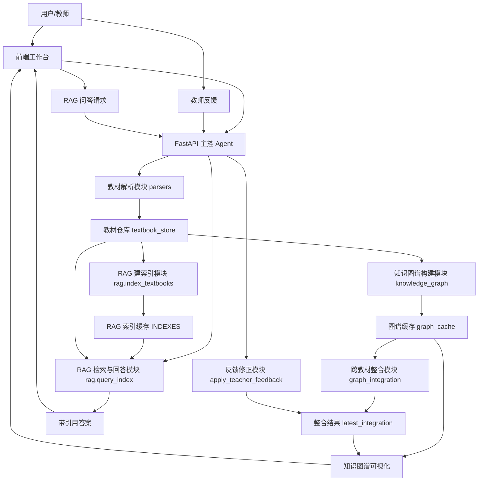

# Agent 架构说明

## 1. 架构总览

### 1.1 架构选择

本系统采用 **“1 个主控 Agent + 5 个工具型模块 + 1 个教师反馈闭环”** 的架构，而不是完全自治的多 Agent 聊天式协作。

这里的 Agent 不是一个把所有任务都塞进超长 prompt 的“大脑”，而是一个 **工作流主控 Agent**：  
它负责根据用户当前动作，按顺序调度教材解析、知识图谱构建、跨教材整合、教师反馈修正和 RAG 问答等能力模块。  
每个模块都通过显式 API 和结构化 JSON 通信，LLM 只在“知识点抽取、语义判断、自然语言回答”这些真正需要语义能力的环节介入。

这种设计的核心目标是：

- 保证端到端链路稳定可复现
- 把长教材处理拆成可验证的小步骤
- 降低 prompt 复杂度和上下文长度
- 让评委能够清楚看到每一步的输入、输出和中间结果

### 1.2 整体架构图



### 1.3 Agent / 模块划分

| Agent / 模块 | 职责 | 输入 | 输出 | 对应代码 |
| --- | --- | --- | --- | --- |
| 主控 Agent | 编排“上传 -> 图谱 -> 整合 -> 反馈 -> 问答”主流程，暴露统一 API | 用户动作、教材 ID、问题、反馈文本 | 结构化响应 | `backend/app/main.py` |
| 教材解析模块 | 解析 PDF / Markdown / TXT / DOCX，统一成教材结构 | 文件流或本地文件路径 | `Textbook` | `backend/app/parsers.py` |
| 教材仓库 | 缓存已解析教材，供图谱和 RAG 复用 | `UploadResult` / `Textbook` | 可查询教材记录 | `backend/app/textbook_store.py` |
| 知识图谱模块 | 按章节抽取知识点和关系，构建单本教材图谱 | `Textbook`、`use_llm` | `TextbookKnowledgeGraph` | `backend/app/knowledge_graph.py` |
| 跨教材整合模块 | 对齐重复/相似知识点，输出 merge / keep / remove 决策和整合图谱 | 多本教材图谱 | `GraphIntegrationResult` | `backend/app/graph_integration.py` |
| 教师反馈模块 | 解析教师自然语言反馈，修正整合结果 | 反馈文本、当前整合结果 | `TeacherFeedbackResult` | `backend/app/graph_integration.py` |
| RAG 模块 | 分块、建索引、检索、回答生成、引用返回 | 教材结构、问题、检索参数 | `RagIndexResponse` / `RagQueryResponse` | `backend/app/rag.py` |
| 前端工作台 | 上传、预览、图谱交互、整合结果查看、RAG 问答 | 后端 API 响应 | 可视化 UI | `frontend/src/**` |

---

## 2. 设计决策论证

### 2.1 为什么选择“单主控 Agent + 多模块”

赛题允许单 Agent 或多 Agent，但本项目选择 **单主控 Agent + 技能模块**，原因主要有四点。

#### 1. 任务链路天然是强顺序、强依赖的

这道题不是开放式聊天，而是一条非常明确的数据处理链：

1. 先解析教材
2. 再为单本教材构图
3. 再做跨教材整合
4. 最后基于整合后的知识进行问答

如果前一步没有完成，后一步没有可靠输入。因此，用显式工作流来组织，比让多个 Agent 彼此协商“下一步该做什么”更稳定。

#### 2. 长文本场景下，模块化比大 prompt 更可控

教材是典型长文档。若让一个大 Agent 同时负责解析、抽取、整合、问答，很容易出现：

- prompt 过长
- 上下文污染
- 输出不可复现
- 某一步失败时难以定位问题

当前设计把整本教材拆成章节、把章节拆成 chunk，每一步都只处理局部信息，显著降低了上下文压力。

#### 3. 黑客松场景优先要“稳定可演示”

在 5 小时比赛里，最重要的不是 Agent 数量多，而是：

- 上传后能解析
- 图谱能生成
- 整合有决策依据
- 问答有引用来源

因此本项目优先使用确定性代码处理 ETL、缓存、相似度和状态管理，把 LLM 用在真正需要语义理解的位置。

#### 4. 这种结构保留了后续升级空间

当前架构虽然不是多 Agent 协作系统，但已经具备明显的 **Skills-Agent** 雏形：

- 主控 Agent 负责决策和调度
- 解析、图谱、整合、反馈、RAG 都可以视为可复用技能模块

未来如果要升级成多 Agent，只需要把其中若干模块包装成独立 Agent，而不需要推翻现有接口。

### 2.2 为什么当前不拆成多个自主 Agent

我们参考过“医疗助手”那类多 Agent 架构经验，确实可以拆成：

- 解析 Agent
- 图谱 Agent
- 整合 Agent
- 审校 Agent
- 问答 Agent

但当前版本没有这么做，原因是：

1. **协调成本高于收益**  
   多 Agent 需要额外设计任务分配、消息协议、共享状态和失败恢复机制。

2. **本题 P0 的核心矛盾不是‘推理太复杂’，而是‘数据链路要稳’**  
   当前最关键的是教材结构统一、图谱 schema 一致、整合规则可解释、RAG 引用可信。

3. **没有 benchmark 支撑时，盲目多 Agent 不一定加分**  
   如果没有实验数据证明多 Agent 带来更高的图谱质量或问答准确率，评委更容易把它看成形式化拆分。

### 2.3 模块边界如何划定

本系统按“输入类型 + 输出类型 + 失败边界”划分职责：

- **解析模块**：只负责把非结构化文件变成结构化教材，不关心图谱和问答
- **图谱模块**：只负责单本教材内部的知识点和关系抽取
- **整合模块**：只负责跨教材对齐与压缩，不负责回答用户问题
- **反馈模块**：只负责修改整合决策，不重新跑全文处理
- **RAG 模块**：只负责检索和生成，不参与图谱整合

这样的边界划分有两个好处：

1. 每个模块都可以独立测试  
2. 某个模块替换实现时，不会牵连整条链路

### 2.4 Agent 与模块如何通信和协调

当前系统不采用“Agent 对话式通信”，而采用 **主控 Agent + 类型化 JSON 协议**：

- 通信载体：FastAPI 路由调用
- 状态共享：`textbook_store`、`graph_cache`、`latest_integration`、`INDEXES`
- 数据格式：Pydantic schema / dataclass

这意味着协调逻辑是显式的：

- 主控 Agent 决定“现在该调用哪个模块”
- 模块只接收结构化输入，返回结构化输出
- 前端和评委都能直接检查中间结果

这种方式比隐式自然语言消息传递更可控，也更符合黑客松验收需要。

### 2.5 Prompt 复杂度和上下文长度如何控制

系统避免把整本教材一次性送给 LLM，主要策略有三层：

#### 1. 章节级处理

知识图谱抽取按章节进行，每次只处理一个章节，而不是整本书。

#### 2. chunk 级检索

RAG 将正文按 `650` 字默认粒度切块，`80` 字 overlap，问答时只注入 top-k 相关 chunk。

#### 3. 明确约束 prompt 责任范围

- 抽取 prompt：只做 JSON 化知识点/关系抽取
- 回答 prompt：只基于上下文回答并附带引用
- 找不到内容时：返回固定兜底文案

这套设计本质上是在用“模块边界”替代“超大 prompt”。

---

## 3. 数据流与调用链路

### 3.1 端到端流程

一次完整的“上传教材 -> 构建图谱 -> 整合 -> 问答”流程如下：

#### Step 1：上传教材

用户在前端上传 PDF / Markdown / TXT / DOCX 文件，主控 Agent 调用解析模块。

输入：

- 文件二进制
- 文件名
- 文件格式

输出：

- 统一 `Textbook` 结构
- 包含教材元数据、章节列表、页码范围、章节正文、字数统计

结果写入：

- `textbook_store`

#### Step 2：构建单本教材知识图谱

用户点击“生成图谱”后，主控 Agent 从教材仓库读取教材，调用知识图谱模块。

输入：

- `Textbook`
- `use_llm`

输出：

- `TextbookKnowledgeGraph`
- 节点：知识点名称、定义、类别、章节、页码、教材来源
- 边：`contains` / `prerequisite` / `parallel` / `applies_to`

结果写入：

- `app_state.graph_cache`

#### Step 3：跨教材整合

用户点击“执行整合”后，主控 Agent 将多本教材图谱交给整合模块。

输入：

- 多个 `TextbookKnowledgeGraph`

输出：

- `GraphIntegrationResult`
- 决策列表：`merge` / `keep` / `remove`
- 整合图谱
- 压缩统计信息

结果写入：

- `app_state.latest_integration`

#### Step 4：教师反馈修正

教师对整合结果提出自然语言反馈，例如：

- “保留免疫应答”
- “把抗原和免疫原拆开”

主控 Agent 调用反馈模块。

输入：

- 当前整合结果
- 教师反馈文本

输出：

- 更新后的 `GraphIntegrationResult`
- 已应用修改
- 无法解析的指令

#### Step 5：RAG 建索引与问答

用户进入 RAG 问答区后，主控 Agent 调用 RAG 模块：

1. 先按教材章节建索引
2. 再对用户问题检索 top-k chunk
3. 生成回答并返回引用

输入：

- 教材结构
- `chunk_size` / `chunk_overlap`
- 用户 query
- `top_k` / `min_score` / `retrieval_mode`

输出：

- `answer`
- `citations`
- `source_chunks`
- `retrieval` 元信息

### 3.2 关键接口输入输出

#### `POST /api/textbooks/upload`

作用：上传并解析教材

输入：

- `multipart/form-data`
- 字段 `files`

输出：

```json
{
  "results": [
    {
      "filename": "生理学.pdf",
      "format": "pdf",
      "size": 1024,
      "status": "completed",
      "error": null,
      "textbook": {
        "textbook_id": "book_01",
        "filename": "生理学.pdf",
        "title": "生理学",
        "total_pages": 520,
        "total_chars": 385000,
        "chapters": []
      }
    }
  ]
}
```

#### `POST /api/graphs/build`

作用：为指定教材构建单书图谱

输入：

```json
{
  "textbook_ids": ["book_01", "book_02"],
  "use_llm": false
}
```

输出：

```json
{
  "graphs": [
    {
      "graph_id": "graph_book_01",
      "textbook_id": "book_01",
      "nodes": [],
      "edges": []
    }
  ]
}
```

#### `POST /api/integration/build`

作用：整合多本教材图谱

输入：

```json
{
  "graphs": []
}
```

输出：

```json
{
  "decisions": [
    {
      "decision_id": "decision_merge_001",
      "decision": "merge",
      "node_ids": ["book_01:n1", "book_02:n8"],
      "canonical_name": "炎症",
      "score": 0.92,
      "reason": "规范化名称、token Jaccard 与定义相似度达到合并阈值。"
    }
  ],
  "merged_graph": {
    "graph_id": "integrated_graph",
    "textbook_ids": ["book_01", "book_02"],
    "nodes": [],
    "edges": []
  },
  "stats": {
    "source_graph_count": 2,
    "source_node_count": 100,
    "merged_node_count": 65,
    "compression_ratio": 0.65,
    "node_reduction_ratio": 0.35
  }
}
```

#### `POST /api/integration/feedback`

作用：根据教师反馈修正整合结果

输入：

```json
{
  "feedback": "请保留“免疫应答”；把“抗原”和“免疫原”拆开"
}
```

输出：

- 更新后的整合结果
- 已应用修改列表
- 无法处理的反馈句子

#### `POST /api/rag/index`

作用：建立 RAG 索引

输入：

```json
{
  "index_id": "default",
  "textbooks": [],
  "chunk_size": 650,
  "chunk_overlap": 80,
  "embedding_model": null
}
```

输出：

```json
{
  "index_id": "default",
  "textbook_count": 7,
  "chapter_count": 120,
  "chunk_count": 1800,
  "chunk_size": 650,
  "chunk_overlap": 80
}
```

#### `POST /api/rag/query`

作用：执行检索并返回带引用回答

输入：

```json
{
  "query": "炎症的基本概念是什么？",
  "index_id": "default",
  "top_k": 5,
  "min_score": 0.08,
  "retrieval_mode": "hybrid"
}
```

输出：

```json
{
  "answer": "炎症是机体对致炎因子的损伤所发生的防御性反应... [1]",
  "citations": [
    {
      "citation_id": "[1]",
      "textbook_title": "病理学",
      "chapter_title": "第四章 炎症",
      "page_start": 78,
      "page_end": 80,
      "score": 0.92
    }
  ],
  "source_chunks": [],
  "retrieval": {
    "index_id": "default",
    "retrieval_mode": "hybrid",
    "top_k": 5,
    "matched_chunks": 1
  }
}
```

---

## 4. 为什么这份架构适合本题

结合赛题要求，这种架构能比较好地回答三个关键问题：

### 4.1 为什么不是“一个超级 Agent 干到底”

因为这道题的核心不是自由推理，而是 **长文档处理、结构化抽取、可解释整合、可追溯问答**。  
如果用一个大 Agent 直接处理整本教材，会在上下文长度、稳定性、调试难度和引用准确性上同时吃亏。

### 4.2 为什么不是“多个 Agent 互相讨论”

因为当前任务是数据处理流水线，不是多角色头脑风暴。  
多 Agent 会增加系统复杂度，但对 P0 的直接收益有限。

### 4.3 为什么这是一个合理的 Agent 架构

因为它把 Agent 的价值放在了最合适的位置：

- 用 Agent 负责决策和调度
- 用模块负责确定性执行
- 用结构化协议保证链路清晰
- 用 LLM 只处理真正需要语义能力的环节

这个取舍既吸收了多 Agent 系统“能力解耦”的优点，也避免了黑客松场景下过重的调度开销。

---

## 5. 当前局限与后续升级方向

### 当前局限

- 当前教材仓库、图谱缓存、RAG 索引主要是内存态，服务重启会丢失
- 跨教材整合目前以规则和轻量相似度为主，复杂同义词仍可能漏合并
- 教师反馈当前是规则驱动，适合显式指令，不适合长链推理
- RAG 当前保留 embedding 接口，但默认还是轻量本地混合检索

### 后续升级方向

1. 接入真正 embedding 模型和 FAISS / ChromaDB
2. 将整合模块升级为“两阶段决策”：规则召回候选 + LLM 复核临界样本
3. 将教师反馈升级为可带历史记忆的审校 Agent
4. 在现有模块接口不变的前提下，平滑升级为多 Agent 架构，例如：
   - 图谱构建 Agent
   - 整合决策 Agent
   - 教师反馈审校 Agent
   - RAG 问答 Agent

换句话说，当前版本是一个 **适合黑客松交付的轻量 Agent 架构**，后续版本则可以沿着同一套接口自然进化为更完整的多 Agent 系统。
